<div align="center">
<svg width="100%" viewBox="0 0 900 220" xmlns="http://www.w3.org/2000/svg">
  <defs>
    <linearGradient id="bg" x1="0%" y1="0%" x2="100%" y2="100%">
      <stop offset="0%" style="stop-color:#0f172a"/>
      <stop offset="35%" style="stop-color:#1e1b4b"/>
      <stop offset="65%" style="stop-color:#0d0221"/>
      <stop offset="100%" style="stop-color:#020617"/>
    </linearGradient>
  </defs>
  <rect width="900" height="220" fill="url(#bg)"/>
  <ellipse cx="800" cy="50" rx="250" ry="80" fill="#6366f1" opacity="0.1"/>
  <ellipse cx="100" cy="170" rx="180" ry="60" fill="#a855f7" opacity="0.08"/>
  <path d="M0,180 Q250,150 450,175 Q650,200 900,165 L900,220 L0,220 Z" fill="#4f46e5" opacity="0.15"/>
  <text x="450" y="105" font-family="'Segoe UI', Arial, sans-serif" font-size="52" font-weight="900" fill="#818cf8" text-anchor="middle" letter-spacing="6">RESUME GENIUS AI</text>
  <text x="450" y="145" font-family="'Segoe UI', Arial, sans-serif" font-size="16" font-weight="400" fill="#94a3b8" text-anchor="middle" letter-spacing="2">Smart Tailoring Engine for Intelligent Job Applications</text>
</svg>

<a href="https://git.io/typing-svg">
  
</a><br/>


&nbsp;

&nbsp;

</div>


◈ System Blueprint

<table>
<tr>
<td width="55%">

```javascript
// ai_resume_logic.js
const systemConfig = {
  fixedContext: [
    "Personal Info", "Education", 
    "Certificates", "Experience Titles"
  ],
  dynamicGeneration: {
    engine: "GPT-4 / Llama-3",
    targets: ["Summary", "Competencies", "Bullet Points"],
    format: "Context-Aware Job Matching"
  },
  output: "Pixel-Perfect PDF (Puppeteer)",
  security: "Zero-Data-Persistence Environment"
};

```

◈ Capabilities at a Glance

◈ Technical Architecture

```mermaid
graph TD
    User[Job Description Input] --> UI[React Frontend]
    UI --> API[Node.js / Express]
    
    subgraph "Intelligence Engine"
    API --> AI{AI Provider}
    AI -- Cloud --> OpenAI[GPT-4 API]
    AI -- Local --> Ollama[Llama-3 Local]
    end
    
    subgraph "Document Assembly"
    API --> JSON[base_resume.json]
    API --> Template[HTML/CSS Template]
    Template --> PDF[Puppeteer PDF Engine]
    end
    
    PDF --> Download[Tailored Resume.pdf]
    
    style AI fill:#1e1b4b,stroke:#818cf8,stroke-width:2px;
    style PDF fill:#0d1e2d,stroke:#a855f7,stroke-width:2px;

```



◈ Installation & Deployment

### 1. Clone & Core Setup

```bash
git clone <repository-url>
cd resume-builder

```

### 2. Backend Ignition

```bash
cd backend
npm install
# Configure your .env (OpenAI/Ollama)
npm start

```

### 3. Frontend Ignition

```bash
cd ../frontend
npm install
npm start

```

◈ API Controller Interface

| Method | Endpoint | Context / Description |
| --- | --- | --- |
| `GET` | `/api/fixed-fields` | Retrieve immutable identity and education data |
| `POST` | `/api/generate` | Trigger AI generation based on job description |
| `POST` | `/api/inject` | Build and return pixel-perfect PDF binary |

◈ Advanced Troubleshooting Matrix

| 🔭 Issue | 📌 Potential Vector | 🎯 Resolution Path |
| --- | --- | --- |
| Puppeteer Fail | Missing Chromium dependencies | Reinstall Puppeteer / Check OS fonts |
| Link Issues | Improper HTML template tags | Use `<a>` tags with `{{LINKEDIN}}` |
| AI Connection | API Key or Local Port 11434 | Verify `.env` or run `ollama serve` |
| Port Conflict | Port 4000/3000 in use | Kill process using `lsof -ti:4000` |

◈ Formatting & Compliance

* **Bullet Policy**: System enforces the `•` character for professional consistency.
* **ATS Compatibility**: Optimized HTML-to-PDF structure for machine readability.
* **Privacy**: Personal data is stored locally in `base_resume.json`—never sent to AI unless mapped as variable.
